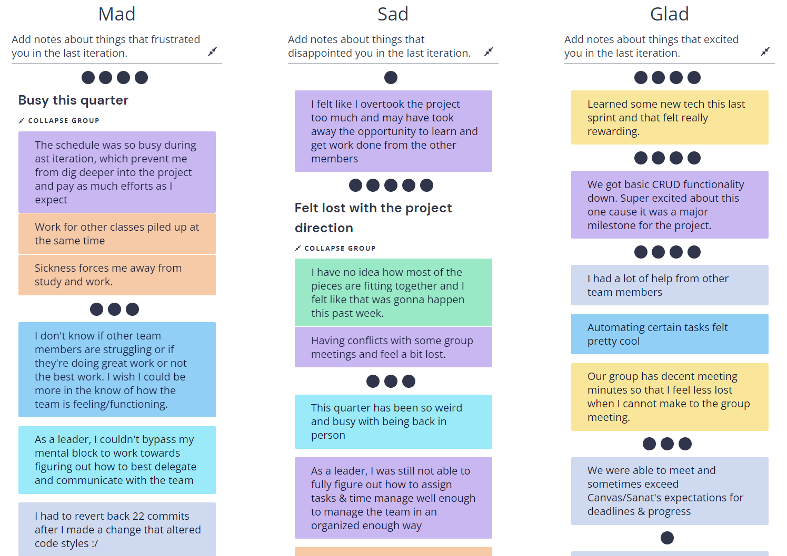

# Sprint 2 & 3 Retrospective

## Info

### Time & Place

-   Group 5
-   Thursday, December 02, 2021
-   8:00pm @ https://ucsd.zoom.us/my/adory

### Attendance

-   [x] Adory
-   [x] Hanming
-   [ ] Steven
-   [x] Royce
-   [x] Divneet
-   [ ] Julian
-   [x] Xuan
-   [x] Robert (Bobby)
-   [x] Sizhe (Chris)

---

## Agenda

### Previous Meeting

-   Sprint 1 Review: Updates on development phase
-   More resources & guidance
    -   Canvas assignments
    -   Priority tasks
    -   Project milestones
-

### Current Meeting

-   We will be going over sprint 2 & 3 progress.

### For next time!

-   Running Retrospectives activities.

---

## Sprint review

-   Go over work accomplishment
    -   Screen captures or demo videos
    -   Do not criticize or correct the agile process
-   "This ceremony is usually called a sprint review meeting and it serves as a time for team members to "show and tell" what has been accomplished. Very often stake holders and managers will be invited to this meeting to see the progress made." - Canvas
-   "Do note that the purpose of this meeting is to go over work accomplishment and not to criticize or correct the agile process. Process review and improvement is the main purpose of the retrospective activity and is covered in a separate assignment." - Canvas

---

## Retrium

---

## Additional Remarks

### Remaining Questions / Concerns

---

## Decisions & Takeaways

-   Looking good so far - make it through the last stretch!

---

Meeting finish time: 8:30pm (30 min)
